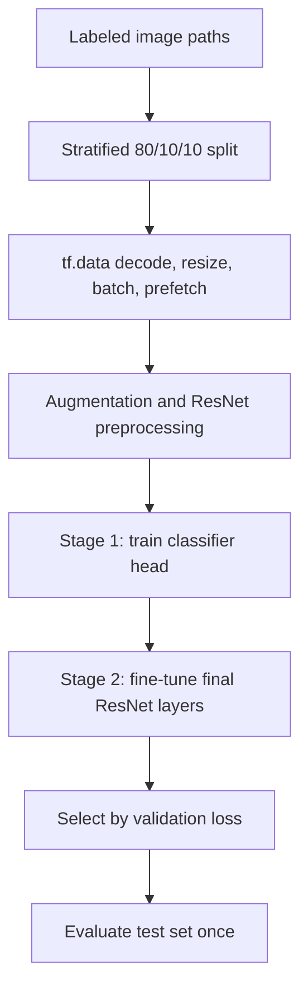

# Deep Learning Facial Image Classification

A TensorFlow/Keras computer-vision project comparing neural-network architectures on 2,526 facial images labeled by a public autism-related dataset. The project progresses from dense and custom convolutional baselines to ImageNet-pretrained MobileNetV2 and ResNet50 models, then applies two-stage transfer learning to the strongest architecture.

> This is an image-classification experiment, not an autism screening or diagnostic system. Facial appearance cannot establish an autism diagnosis, the dataset labels may encode confounding factors, and the model has not been clinically validated.

## Results at a Glance

| Item | Recorded result |
|---|---:|
| Dataset size | 2,526 images |
| Split | 2,020 train / 253 validation / 253 test |
| Best architecture | Fine-tuned ResNet50 |
| Best validation accuracy | 87.9% |
| Held-out test accuracy | 83.5% |
| Held-out test ROC-AUC | 0.917 |

The test set was evaluated once after model selection by validation loss. Results come from the final recorded notebook run using a fixed seed and a stratified image-level 80/10/10 split.

## What the Project Demonstrates

- Comparative experimentation across dense networks, custom CNNs, MobileNetV2, and ResNet50.
- Transfer learning from ImageNet with a frozen feature-extraction stage followed by selective fine-tuning.
- A reproducible `tf.data` pipeline with stratified train/validation/test splits.
- Image augmentation, dropout, L2 regularization, early stopping, learning-rate reduction, and model checkpointing.
- Final model selection by validation loss followed by one held-out test evaluation.
- Explicit documentation of dataset, evaluation, and ethical limitations.

## Architectures Explored

| Model family | Variants |
|---|---|
| Dense baseline | Fully connected network on flattened pixels |
| Custom CNNs | Baseline, regularized, and deeper convolutional networks |
| MobileNetV2 | Frozen ImageNet feature extractor and partial fine-tuning |
| ResNet50 | Frozen ImageNet feature extractor and two-stage fine-tuning |

The repository's reusable training script focuses on the final ResNet50 pipeline. The original architecture comparison motivated that selection.

## Final Training Pipeline



## Repository Structure

```text
.
├── notebooks/
│   └── facial_autism_classification.ipynb  # Concise experiment walkthrough
├── src/
│   ├── data.py                             # Dataset discovery and stratified splitting
│   └── train_resnet.py                     # End-to-end two-stage training CLI
├── tests/
│   └── test_data.py                        # Split reproducibility and leakage checks
├── requirements.txt
├── requirements-dev.txt
└── LICENSE
```

## Run Locally

Python 3.10 or newer is recommended.

```bash
python -m venv .venv
source .venv/bin/activate
pip install -r requirements.txt
```

Organize the dataset as:

```text
dataset/
├── autistic/
└── non_autistic/
```

The images are not redistributed in this repository. Run the strongest training pipeline with:

```bash
python -m src.train_resnet \
  --dataset path/to/dataset \
  --output-dir output/resnet50
```

The command writes stage checkpoints and a `metrics.json` summary to the output directory.

On Windows PowerShell, activate the environment with:

```powershell
.venv\Scripts\Activate.ps1
```

## Tests

The tests use synthetic path/label arrays and do not require TensorFlow or the image dataset.

```bash
pip install -r requirements-dev.txt
pytest
```

## Methodology Notes

- **Fixed stratified split:** A fixed seed preserves class proportions and makes the 80/10/10 path split reproducible.
- **No test-set tuning:** Checkpoints are compared using validation loss; the selected model is then evaluated on the held-out test set once.
- **Two-stage transfer learning:** The classifier head is warmed up with the ResNet base frozen before the final ResNet layers are fine-tuned at a lower learning rate.
- **Batch normalization stability:** Batch-normalization layers remain frozen during fine-tuning, and the pretrained base runs in inference mode.
- **Class imbalance awareness:** Accuracy and ROC-AUC are recorded together because a single threshold does not capture ranking quality.

## Limitations

- The dataset is small for deep learning and may not represent the broader population.
- The recorded split is image-level. If multiple images of the same person exist, an identity-disjoint split is required to prevent person-level leakage and should replace the reported evaluation.
- Demographics, lighting, backgrounds, image compression, and source collection may correlate with labels and create spurious shortcuts.
- The dataset's labels do not make facial images a valid diagnostic signal.
- The work is an educational architecture comparison, not peer-reviewed research or a deployable clinical product.

## License

The source code is available under the MIT License. Dataset images and pretrained model weights are governed by their respective sources and are not included.
